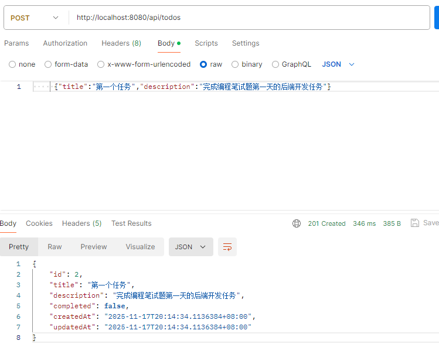
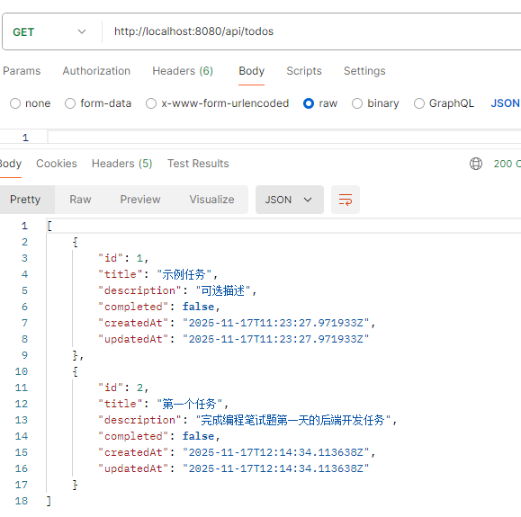
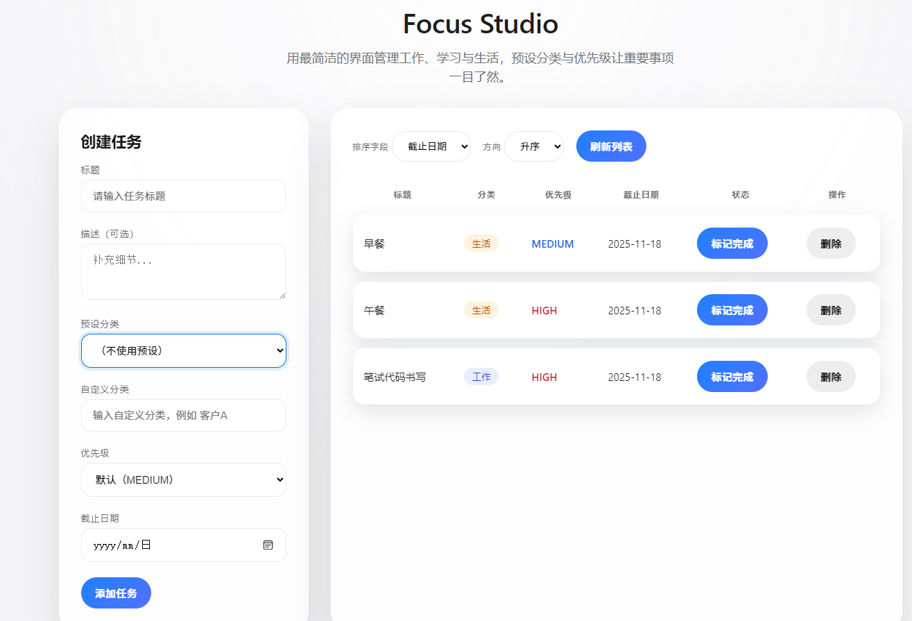
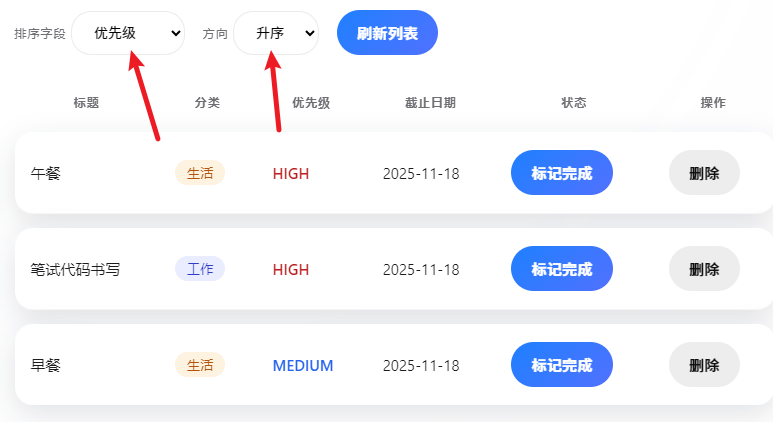
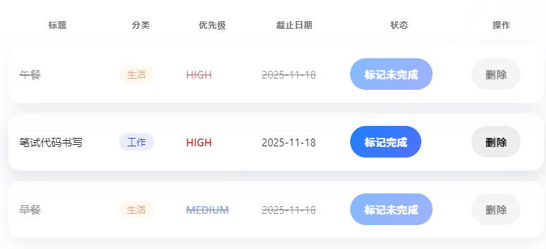
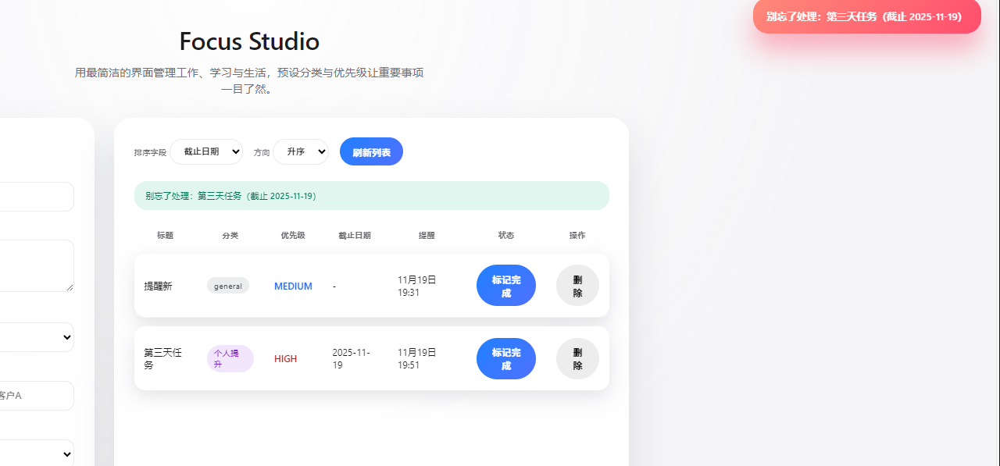

## 笔试解题思路（迭代计划）

### 第一天实现进度：
1. **后端开发环节搭建**：SpringBoot3(Java17)、数据持久化：Mysql-8.0.42、配置了Mysql连接、JPA自动建表和Sql日志等选项
2. **model层TodoItem实体目前包括**:id/title/description/completed/createdAt/updatedAt，通过 @PrePersist/@PreUpdate 自动维护时间戳，还未加入分类、优先级、截止日期等字段
3. **rest接口层**：TodoController实现基本的列表、创建、完成状态转换、删除功能
4. **业务与持久化**：TodoService 完成了 基本CRUD 核心逻辑、TodoItemRepository 继承 JpaRepository，提供数据访问能力。
5. **异常处理**：GlobalExceptionHandler 针对找不到任务和参数校验失败返回统一的 ProblemDetail JSON，以及自定义异常：表示根据ID找不到任务；

#### 测试结果：通过PostMan检查创建、查询、删除三类接口的相应情况及功能正确，测试通过；

修改完成状态：

### 第二天实现进度：
1. **实体新增字段**：String category任务类别, TodoPriority priority 任务优先级, LocalDate dueDate 任务截止日期,
2. **任务类别**：
   1）通过枚举类设置预设任务类别，分别有 WORK("工作"), STUDY("学习"), LIFE("生活"), HEALTH("健康"), PERSONAL("个人提升");
   2）用户输入自定义类别标签; 
   3）默认值：general
3. **任务优先级**：通过枚举类设置任务的优先级   LOW, MEDIUM, HIGH（默认值为Medium）;
4. **任务排序**：实现接口`GET /api/todos` 支持 `sortBy`（`priority`/`dueDate`/`createdAt`/`updatedAt`）与 `direction`（`asc`/`desc`）进行排序。
    排序异常处理：限制排序字段为以上四种，否则会抛出异常（此外前端也会限制排序字段的选择）
5. **前端页面设计**:
   1)创建任务模块：标题、描述、预设分类下拉+自定义输入、优先级、截止日期
   2）刷新列表：排序字段+排序方向
   3）每条任务模块：标记完成操作+删除操作

#### 测试结果：
    后端接口验证：
1. **获取预设分类**:   GET http://localhost:8080/api/todos/meta/categories
    返回一个数组，里面有 code/label（工作、学习、生活、健康、个人提升）。
2. **创建使用预设分类的任务**：   POST http://localhost:8080/api/todos
   Content-Type: application/json
   {
   "title": "编写接口",
   "description": "完成 CRUD 逻辑",
   "presetCategory": "WORK",
   "priority": "HIGH",
   "dueDate": "2025-01-15"
   }
3. **创建自定义分类任务**： 
   {
         "title": "整理文档",
         "description": "补充 README",
         "category": "学习",
         "priority": "LOW",
         "dueDate": "2025-01-10"
   }
4. **按照截止日期排序查看**：   GET http://localhost:8080/api/todos?sortBy=dueDate&direction=asc
5. **切换完成状态**：   PATCH http://localhost:8080/api/todos/{id}/toggle ，再次 GET /api/todos 验证 completed 变为 true。
6. **删除任务**：   DELETE http://localhost:8080/api/todos/{id}

### 第三天实现进度（进阶功能：提醒/通知）
- **后端**：实现“提醒/通知”能力，让任务在设定的时间前触发提示。
1. **TodoItem**新增 'reminderAt'字段，记录提醒时间
2. **TodoController暴露接口** `GET /api/todos/upcoming-reminders?minutes=60` 返回未来一定时间内需要提醒的任务，方便多端轮询。
3. **增加upcomingReminders(minutes)服务**：创建时保存提示时间
- **前端**
1. **表单新增**:提醒时间输入
2. **提醒功能**：使用浏览器 Notification API 实现本地提醒
3. **提醒功能优化**：为了让提醒效果更好，新增右上角reminderToast浮层，显示渐变背景，脉冲动画醒目提醒文案，6秒后消失
    同时保留浏览器的Notification提醒浮层，保证双重提示（后者显示时间2秒小时，从而不影响用户的正常体验）
    触发提醒时，播放轻微滴声，进一步增强感知；
#### 测试结果：
1.  POST 创建带 reminderAt 的任务，格式如 "reminderAt": "2025-01-20T10:30:00Z".
2.  GET http://localhost:8080/api/todos/upcoming-reminders?minutes=120 查看即将提醒的任务。
3.  打开 http://localhost:8080/，允许通知，创建带提醒的任务，等待到点弹出浏览器通知。
4.  通过前端页面实现带reminderAt的任务，以及提醒功能；

